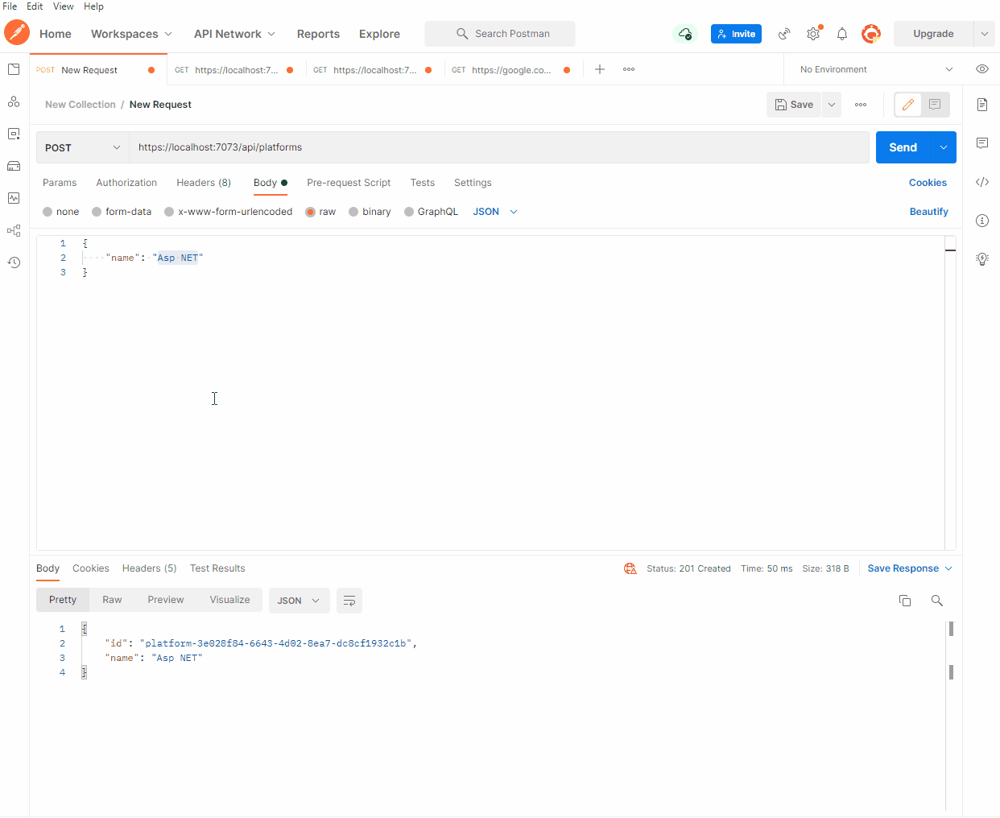

<h1 align="center" > RedisAPI </h1>
<h2 align="center">
    <a href="https://docs.redis.com/latest/rs/references/client_references/client_csharp/">🔗 Redis Api</a>
</h2>

 Uma API simples para aprender os principios do redis

 <a href="#Objetivo">Objetivo</a> •
 <a href="#Features">Features</a> •
 <a href="#Demostração">Demostração  </a> • 
 <a href="#Pre-requisitos">Pré-requisitos</a> • 
 <a href="#Tecnogias">Tecnogias Usadas  </a> • 
 <a href="#Pacotes">Pacotes Adiconados </a> • 
 <a href="#licenca">Licença  </a> • 
 <a href="#conclusao">Conclusão  </a>

<h3 align="center"> 
 Status:	Finalizado
</h4>
<h2 name = "Objetivo"> Objetivo </h2>

 Aprender mais sobre o banco de dados redis, através de um projeto simples usando essa tecnologia 

<h2 name = "Features" >Features</h2>
<ul>
 <li>Criar Plataform no banco de dados</li>
 <li>Buscar todas Platforms do banco de dados</li>
 <li>Buscar Plataform por ID no banco de dados</li>

 </ul>
 
 <h2 name="Demostração"> Demostração</h2>
  
  
  <h3 name="Pre-requisitos" >Pré-requisitos</h3>
  
Antes de começar, você vai precisar ter instalado em sua máquina as seguintes ferramentas:

  <a href="https://dotnet.microsoft.com/en-us/download/dotnet/6.0" > .NET 6 </a>
  

  <a href="https://www.docker.com/">Docker </a>
  
  <h2 name = "Tecnogias" >Tecnologias Usadas</h2>
<ul>
 <li><a href="https://docs.microsoft.com/pt-br/dotnet/csharp/">Linguagem C# </a></li>
 <li><a href="https://docs.microsoft.com/pt-br/aspnet/core/?view=aspnetcore-6.0">Asp Net Core </a></li>
 <li><a href="https://redis.io/">Redis </a></li>
 <li><a href="https://www.docker.com/">Docker </a></li>
 </ul>
 
   <h2 name = "Pacotes" >Pacotes Adicionados</h2>
<ul>
 <li><a href="https://www.nuget.org/packages/Microsoft.Extensions.Caching.StackExchangeRedis/7.0.0-preview.2.22153.2">Microsoft.Extensions.Caching.StackExchangeRedis v7.0.0</a></li>
 <li><a href="https://www.nuget.org/packages/Swashbuckle.AspNetCore/">Swashbuckle.AspNetCore v6.2.3</a></li>
 </ul>
 
 <h2 name="licenca"> Licença </h2>
 
Esse repositório está licenciado pela MIT LICENSE. Para mais informações detalhadas, leia o arquivo <a href="https://github.com/MarlysonMendes/RedisAPI/blob/main/LICENSE">LICENSE</a> contido nesse repositório.

 
 <h2 name = "conclusao"> Conclusão </h2>
 
Esse projeto contribui para o entendimento de como funciona um sistema que usa o redis como banco de dados, além de ajudar a exemplificar alguns conceitos do redis

 
